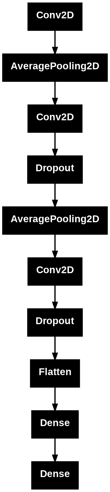
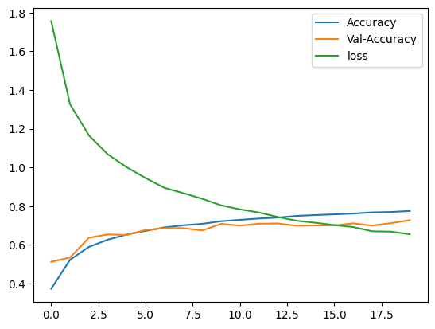

# TensorFlow Image Classification Project

## Overview
This project demonstrates a TensorFlow-based image classification pipeline, including data preprocessing, augmentation, model building, and training using Convolutional Neural Networks (CNNs). The dataset consists of images stored in Google Drive, categorized into different classes for training and testing.

It is just a baby step in my long journey to be professional in deep learning, I hope it helps beginners who are curios about deep learning.  


## Features
- **Tensor Operations**: Introduction to TensorFlow tensors and basic operations.
- **Data Loading**: Fetching and organizing image data from Google Drive.
- **Data Preprocessing**: Resizing, converting to RGB, and structuring datasets for model training.
- **Data Augmentation**: Enhancing dataset diversity using flipping, rotation, and zooming.
- **CNN Model Construction**: A sequential CNN model with multiple convolutional, pooling, dropout, and dense layers.
- **Model Training and Evaluation**: Using the CIFAR-10 dataset for training and visualization of accuracy and loss.
- **Model Saving**: Exporting the trained model for future use.

## Prerequisites
- Google Colab or a local machine with TensorFlow installed
- Python 3.x
- Required libraries:
  ```bash
  pip install tensorflow opencv-python numpy matplotlib scikit-learn imutils
  ```

## File Structure
- **TensorFlow-TUT_Ali.ipynb**: Main script for data loading, preprocessing, model building, and training.
- **cnn_model.h5**: Trained model saved for future inference.

## Usage
1. **Mount Google Drive**: Ensure images are stored in `/content/drive/MyDrive/animal_database/`.
2. **Run `TensorFlow-TUT_Ali.ipynb`**: Execute the script to preprocess images, train the model, and visualize results.
3. **Model Evaluation**: Inspect training history and validate performance.

## CNN Model Construction


## Results
- The model's accuracy and loss are plotted during training.
- The final trained model can be used for classification tasks.

- ### Model Accuracy and Loss


## Future Improvements
- Implementing hyperparameter tuning.
- Experimenting with different CNN architectures.
- Adding more augmentation techniques to improve generalization.

## Author
Ali Magdi

## License
This project is open-source and free to use for educational and research purposes.

